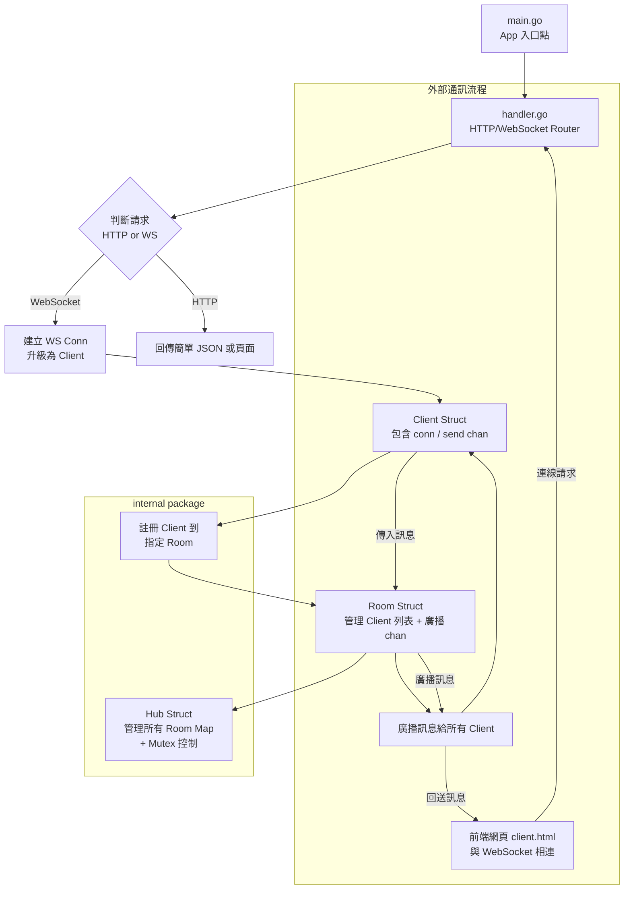

# 🧩 realtime-chat-golang-redis

A multi-room real-time chat server built with Golang, Gin, WebSocket, and Redis.

This side project is designed to explore modern backend engineering patterns including Pub/Sub messaging, WebSocket communication, and modular service architecture. It serves as a personal showcase for backend and DevOps skills.


## 🚀 Features

- ✅ Real-time messaging via WebSocket
- ✅ Support for multiple chat rooms
- ✅ Nickname-based user login
- ✅ In-memory message broadcasting
- 🚧 Redis Pub/Sub integration (coming soon)
- 🚧 Voting mechanism & photo upload (planned)


## 🧱 Tech Stack

- Language: **Golang**
- Web Framework: **Gin**
- Realtime: **WebSocket** (gorilla/websocket)
- Message Sync: **Redis Pub/Sub** (planned)
- State Mgmt: **Go Maps + Mutex**
- Deployment Target: **Docker + GitHub Actions** (future)


## 📁 Project Structure

realtime-chat-golang-redis/  
├── cmd/ main.go # Entry point  
├── internal/  
│ ├── server/ # HTTP + WebSocket server  
│ ├── chat/ # Hub, Client, Room logic  
│ └── redis/ # Redis connection (WIP)  
├── static/ # Frontend UI (HTML/JS)  
├── go.mod  
├── go.sum  
├── README.md


## 📌 Project Architecture Overview




## 🔧 Getting Started

### Prerequisites
- Go 1.20+ installed
- Redis (optional for Pub/Sub)

### Run locally

```bash
git clone https://github.com/zmes40404/realtime-chat-golang-redis.git
cd realtime-chat-golang-redis
go run ./cmd/main.go
```


## 📅 Development Plan

| Phase | Goal | Status |
| ----- | ---- | ------ |
| Phase 1 | Basic chatroom with WebSocket&multi-room | ✅In progress |
| Phase 2 | Add Redis Pub/Sub, vote, photo upload, admin roles | 🔜Coming soon |
| Phase 3 | Refactor and Code Optimization | 🚩 Future work


## ⌚ Future Work
| Item | Description | Status |
| ---- | ----------- | ------ |
|  1.  | Pull all the const setting to .env or config.yaml files | 🔜Coming soon |


## 🙋 Author
- Maton Wang (Pin Li Wang)  
- [LinkedIn](www.linkedin.com/in/matonwang)    
- Side project for Golang + Redis practice  
- For job applications in DevOps, backend, and Web3 sectors